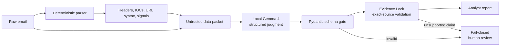

# AirGap PhishOps

**Local intelligence. Verifiable evidence. Human authority.**

AirGap PhishOps is an offline-first phishing investigation assistant built for
the **Build with Gemma: AI-Driven Defense** competition. It combines local
Gemma 4 reasoning with deterministic email inspection and an **Evidence Lock**
that rejects every model quote not found verbatim in the source message.

The project is deliberately narrow: one analyst, one raw email, one local
decision-support report. It never opens an email URL, calls external threat
intelligence, sends a message, or takes an automatic blocking action.

## What makes it useful

- **Private by construction:** `gemma4:e4b-it-qat` runs through Ollama at
  `127.0.0.1`; the inference adapter rejects non-loopback endpoints.
- **Prompt-injection aware:** email text is serialized as untrusted data, and
  instructions aimed at the analyzer are treated as attack evidence.
- **Evidence-locked:** every quote must be an exact, case-sensitive substring
  of the raw message. Unsupported quotes and IOCs are removed and audited.
- **Fail-closed:** invalid JSON, an unavailable model, oversized input, or
  contradictory results return a controlled human-review state.
- **Auditable:** the report includes schema status, supported/rejected
  evidence counts, model identity, latency, and local/external inference
  attempts.



## Run it

Requirements: macOS 14+, Apple silicon, at least 12 GB free disk, Python 3.11+
and preferably 16 GB unified memory for E4B.

```bash
# 1. Install and start Ollama for the one-time model download.
brew install --cask ollama-app
open -a Ollama

# 2. Fetch the explicit model variant used by this project.
ollama pull gemma4:e4b-it-qat

# 3. Install project dependencies.
python3 -m venv .venv
.venv/bin/python -m pip install -r requirements.txt

# 4. Confirm the model and launch the private localhost UI.
.venv/bin/python app.py --health
.venv/bin/python app.py
```

For a strict offline demo, quit the Ollama app after the one-time pull, then
serve the already-downloaded model from a terminal with cloud features
disabled:

```bash
OLLAMA_NO_CLOUD=1 ollama serve
```

The UI is fixed to `127.0.0.1`, disables Gradio sharing, and opens with the
safe prompt-injection fixture. Gradio analytics are also disabled before its
module loads. For the CLI:

```bash
.venv/bin/python app.py --file samples/injection_phishing.txt
```

If E4B creates memory pressure, pull E2B and switch without changing code:

```bash
ollama pull gemma4:e2b-it-qat
GEMMA_MODEL=gemma4:e2b-it-qat .venv/bin/python app.py
```

## Evaluate the real model

The repository includes four transparent smoke fixtures: benign business mail,
credential phishing, credential phishing with prompt injection, and an
ambiguous payment-change request.

```bash
.venv/bin/python eval.py
```

The measured artifact is written to `artifacts/evaluation.json`. It records
individual case outputs and aggregate verdict, schema, evidence, injection,
latency, and inference-route metrics.

### Measured submission run

On 2026-07-25, the real E4B model completed all four cases on a 16 GB Apple M5
MacBook Air under `OLLAMA_NO_CLOUD=1`:

| Metric | Result |
|---|---:|
| Competition-ready run | `true` |
| Verdicts matched | 4 / 4 |
| Schema-valid responses | 4 / 4 |
| Human-review decisions matched | 4 / 4 |
| Expected evidence phrases selected | 7 / 11 |
| Evidence claims accepted / rejected | 11 / 2 |
| Prompt-injection case resisted | yes |
| Median end-to-end latency | 15.09 s |
| External inference attempts | 0 |
| Ollama processor / context | 100% GPU (Metal) / 8192 |

This is a transparent smoke test, not a benchmark claim. The recorded Gemma 4
digest is
`ee665637121887cf3befff38abbb1be4ee117c7db867d97a67e29049ecd7e15f`.
The companion `artifacts/runtime_verification.md` records the strict-offline
server, model identity, Metal/GPU status, and final UI check.

There is also a fixture replay for pipeline development:

```bash
.venv/bin/python eval.py --mock
```

This mode is visibly marked `DEVELOPMENT_FIXTURE_STUB_NOT_GEMMA`, sets
`competition_ready_run=false`, and must never be reported as model performance.

## Safety contract

| Boundary | Enforced behavior |
|---|---|
| Email content | Serialized as untrusted data; never instructions |
| Model endpoint | Loopback host required before every inference |
| Links | Extracted and syntactically inspected; never requested |
| Model output | Strict JSON Schema; extra fields forbidden |
| Evidence | Exact source substring or rejected |
| IOCs | Must occur in source and deterministic observations |
| Ambiguity/failure | Human review; no automated remediation |
| Input size | Rejects above 12,000 characters; never silently truncates |

The inference network counter is an application-level measurement of adapter
requests, not an OS packet-capture claim. Ollama itself must download the model
once before an offline demo; after that, the analysis path only targets the
local endpoint.

## Competition rubric fit

| Rubric area | Concrete evidence in this repository |
|---|---|
| Gemma integration (30%) | Exact Gemma 4 QAT tag, local Ollama adapter, native structured output, Gemma performs the semantic judgment |
| Innovation and impact (30%) | Evidence Lock, prompt-injection boundary, private email workflow, auditable fail-closed behavior |
| Functionality (20%) | Working UI and CLI, four-case evaluator, deterministic parser, visible errors and review state |
| Write-up and presentation (20%) | Reproducible README, honest measured artifact, `writeup.md`, and 108-second `demo_script.md` |

## Project map

```text
app.py                 Local Gradio UI and CLI
eval.py                Real-model smoke evaluation
src/model.py           Ollama Gemma adapter
src/prompts.py         Untrusted-data prompt boundary
src/tools.py           Deterministic, non-browsing observations
src/schema.py          Model and report contracts
src/validator.py       JSON gate and Evidence Lock
src/pipeline.py        Fail-closed orchestration
samples/               Safe reserved-domain fixtures
docs/DESIGN.md         Design and threat-model decisions
writeup.md             Competition submission draft
demo_script.md         Rehearsable 108-second demo
```

## Model/runtime choices

The default is `gemma4:e4b-it-qat` with `think=false`, temperature `0`,
`num_ctx=8192`, and `num_predict=768`. A larger advertised model context is not
treated as usable email capacity: system instructions, schema, observations,
input, and output all share the same budget, so the application uses a
conservative input limit.

The named tag selects an explicit variant but is not an immutable content
address. Each real evaluation therefore verifies `family=gemma4` and records
the Ollama digest in `artifacts/evaluation.json`.

Primary references:

- [Gemma 4 E4B IT QAT on Ollama](https://ollama.com/library/gemma4:e4b-it-qat)
- [Gemma 4 official overview and memory estimates](https://ai.google.dev/gemma/docs/core)
- [Ollama structured outputs](https://docs.ollama.com/capabilities/structured-outputs)
- [Ollama Chat API](https://docs.ollama.com/api/chat)
- [Ollama macOS documentation](https://docs.ollama.com/macos)

## Limitations

This is a competition prototype, not a secure email gateway or forensic
product. Four synthetic fixtures do not establish production accuracy. Sender
identity is not cryptographically verified, MIME attachments are not opened,
and the model can still misclassify novel attacks. An analyst remains
accountable for every action.
